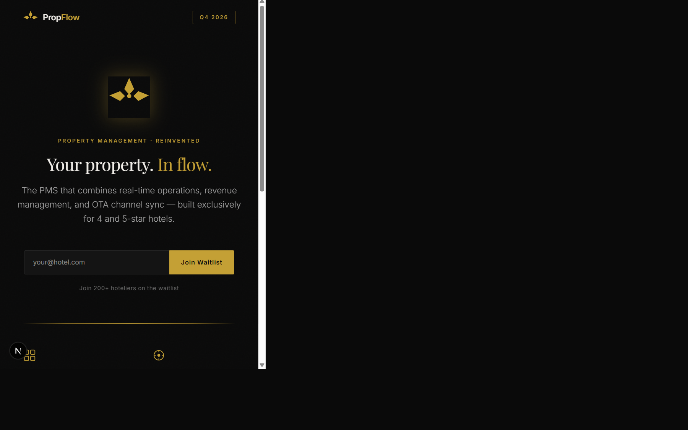
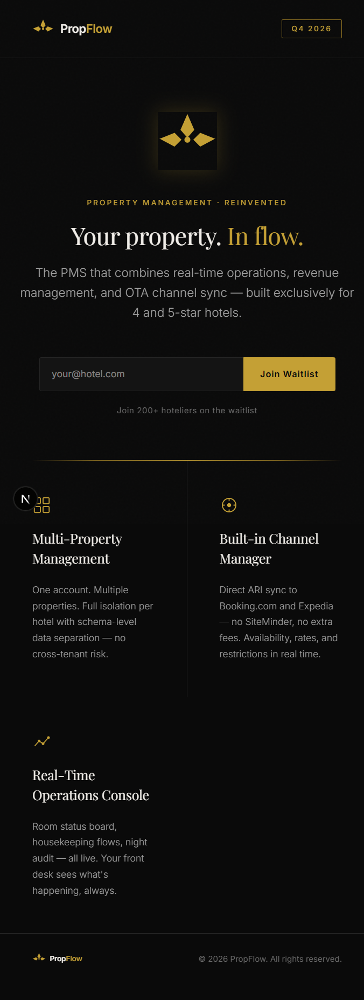

<div align="center">



# PropFlow

**The PMS built for luxury hotels.**

[](https://vercel.com/new/clone?repository-url=https%3A%2F%2Fgithub.com%2FFCHEHIDI%2Fpropflow-landing)
&nbsp;


</div>

---

## Overview

Teaser landing page for **PropFlow** — a multi-tenant SaaS Property Management System targeting 4 and 5-star hotels. Collects waitlist emails via [Resend](https://resend.com).

<div align="center">
  
</div>

---

## Features

- **Dark luxury design** — `#0A0A0A` base, warm gold `#C4A035` accents, subtle CSS grain texture
- **Waitlist form** — email capture with Resend confirmation + team notification
- **Animated hero** — sequential `fadeUp` animations on load
- **Fully responsive** — fluid typography with `clamp()`, grid auto-fit features
- **Zero config deploy** — one-click Vercel deployment

---

## Stack

| Layer | Technology |
|-------|-----------|
| Framework | Next.js 16 (App Router) |
| Styling | Tailwind CSS v4 + CSS custom properties |
| Email | Resend |
| Fonts | Playfair Display + Inter (Google Fonts) |
| Deployment | Vercel |

---

## Getting Started

```bash
# 1. Clone
git clone https://github.com/FCHEHIDI/propflow-landing
cd propflow-landing

# 2. Install
npm install

# 3. Configure environment
cp .env.example .env.local
# → set RESEND_API_KEY and WAITLIST_NOTIFY_EMAIL

# 4. Run dev server
npm run dev
# → http://localhost:3000
```

---

## Environment Variables

| Variable | Required | Description |
|----------|----------|-------------|
| `RESEND_API_KEY` | Yes (prod) | Resend API key from [resend.com](https://resend.com) |
| `WAITLIST_NOTIFY_EMAIL` | No | Email to notify on each signup (default: `hello@propflow.io`) |

> In development without `RESEND_API_KEY`, signups are logged to the console — no emails sent.

---

## Deploy to Vercel

1. Push this repo to GitHub
2. Go to [vercel.com/new](https://vercel.com/new) → import `propflow-landing`
3. Add environment variables in **Settings → Environment Variables**
4. Deploy — done

---

## Related

- [propflow-pms](https://github.com/FCHEHIDI/propflow-pms) — The backend: .NET 9, CQRS/ES, multi-tenant PostgreSQL, channel manager

---

<div align="center">
  <sub>© 2026 PropFlow. All rights reserved.</sub>
</div>
